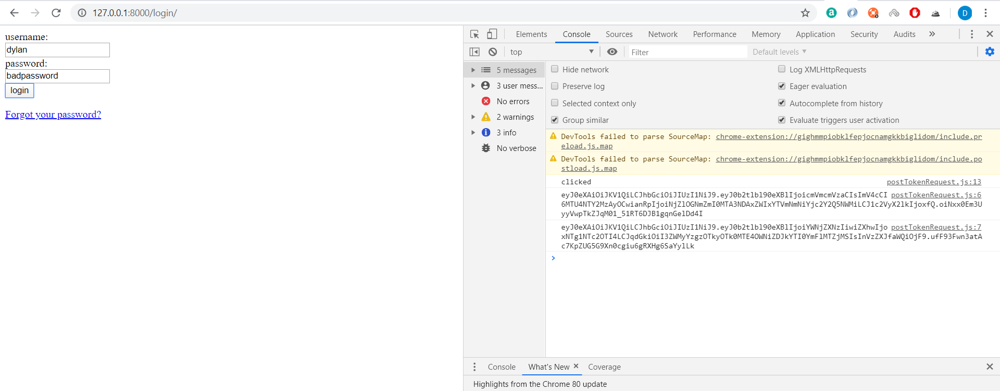
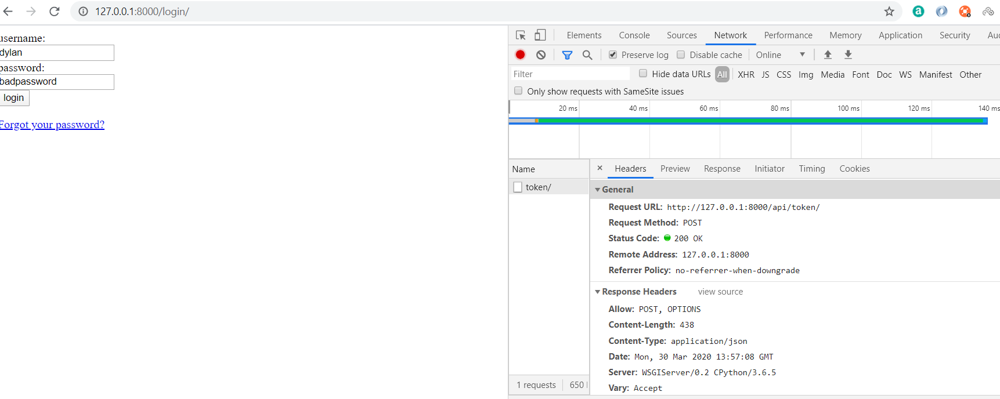
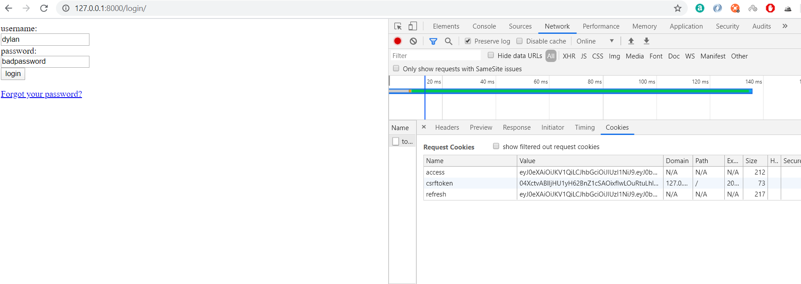

# Django REST Framework JWT Example
Backend code example used in this repoistory [How to Use JWT Authentication with Django REST Framework](https://simpleisbetterthancomplex.com/tutorial/2018/12/19/how-to-use-jwt-authentication-with-django-rest-framework.html).

## Initial request



## Cookie setting



## Running the Project Locally

First, clone the repository to your local machine:

Install the requirements:

```bash
pip install -r requirements.txt
```

Apply the migrations:

```bash
python manage.py migrate
```

Finally, run the development server:

```bash
python manage.py runserver
```

The API endpoints will be available at **127.0.0.1:8000/hello/**.


## License

The source code is released under the [MIT License](https://github.com/sibtc/drf-jwt-example/blob/master/LICENSE).
